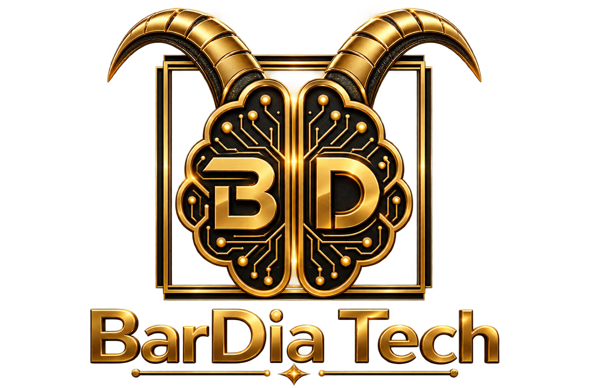

  
  
  # BarDia KhorShidi | Bardia Tech
  ### *Believe. Become. Build.*

  **Full-Stack Developer & Data Architect**  
  *Simplicity is the ultimate sophistication.*

  ---

  ### ⚡ Core 4 Stack
  

    
    
    
    
  

  ---

  ### 🛠 Philosophy & Vision
  > Designing high-impact systems, zero-touch automated data pipelines, and scalable enterprise architectures.

  ---

  ### 🚀 Featured Ecosystems
  * 🔹 **Kaya Pipeline:** Automated Freelance Scraping, Taxonomies & Scoring Engine.
  * 🔹 **Bardia Tech BI:** Real-Time Market Intelligence & Executive Dashboards.

  ---

  

    
  

